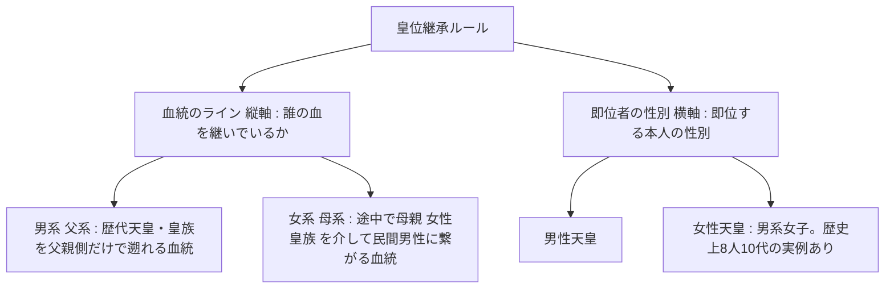

# 皇位継承問題における合理的合意形成への総合提言書
### ── 深層価値の可視化と優先順位の再配列による社会的一致の設計図 ──

> **対象テーマ**: 皇位継承問題 | **最終更新日時 (タイムスタンプ)**: 2026-07-17 21:02:55

---

## 序文：本提言書の目的と合意の必要性

本提言書は、感情的な対立や表層の神学論争を排し、双方の立場の深層にある「価値観（尊ぶもの）」と「事実認識（世界観・リスク予測）」をデータベースから体系的に抽出し、各案のメリット・デメリット（プロコン）を限界まで直視した上で、社会全体の納得性を極大化するための合理的ソリューションおよび自己発見型の対話ロードマップを提示するものです。

---
## 第1章：基本概念と論点の体系的整理

皇位継承問題をめぐる議論において、まず混同されやすい定義、憲法上の位置づけ、歴史的先例、および**2026年7月17日可決の最新法改正**について体系的に整理・定義します。この客観的整理が、議論を誤った二項対立に陥らせないための知的防波堤となります。

### ① 憲法上の位置づけと「世襲」の解釈
日本国憲法第2条は「皇位は、世襲のものであつて、国会の議決した皇室典範の定めるところにより、これを継承する」と定めています。ここで議論となるのは「世襲」の本質的解釈です。
*   **男系限定説（伝統派の前提）**: 憲法第2条の『世襲』とは、歴史的に一貫して『男系（父系）世襲』のみを指してきたため、女系継承を導入することは憲法上の世襲の定義そのものを変質させることになると解釈します。
*   **血統世襲説（変革派の前提）**: 『世襲』とは単に『血による継承』を意味し、必ずしも性別や男系に限定されないため、皇室典範を改正して女性・女系を容認することは憲法第2条の範囲内において国会の立法裁量に属すると解釈します。

### ② 女性天皇と女系天皇の境界（超具体的な区別）
この二つの概念の混同は、議論の混乱の最大の原因です。血統の「縦軸（誰から引いた血か）」と、即位する本人の「横軸（男か女か）」を明確に区別し、具体例を交えて定義します。

#### 【1. 男系（父系）の定義と具体例】
即位する本人の血統を、**「父親、その父親、さらにその父親…」と父方だけを遡っていったとき、最終的に初代天皇（神武天皇）にまで辿り着く血統**のことです。性別は問いません。
*   **男系男子の例（悠仁親王）**: 悠仁親王 ➔ 父（秋篠宮さま） ➔ 祖父（上皇さま） ➔ 曽祖父（昭和天皇）… と、父親だけを遡ると初代神武天皇に繋がります。
*   **男系女子の例（愛子内親王）**: 愛子内親王 ➔ 父（今上天皇） ➔ 祖父（上皇さま） ➔ 曽祖父（昭和天皇）… と、父親だけを遡ると神武天皇に繋がります。愛子内親王が即位した場合は、**「女性天皇（男系女子の女性天皇）」**となります。これは伝統적ルールと完全に合致しており、歴史上の女性天皇も全員このタイプです。

#### 【2. 女系（母系）の定義と具体例】
即位する本人の血統を遡る途中で、**一度でも「母親（女性皇族）」を介して、皇族以外の民間人男性の血が混ざった血統**のことです。
*   **女系天皇の例（架空の子供）**: 仮に、男系女子である愛子内親王が即位して女性天皇となり、皇族以外の一般男性と結婚して子供（仮にXさん）が生まれたとします。
    - Xさんの血統を父親側に遡ると、父親は民間人（天皇の血を引いていない）であるため、途切れます。
    - Xさんの血統を母親側に遡ると、母（愛子内親王） ➔ 外祖父（今上天皇）… と天皇家に繋がります。
    - このように、**「母親の側からのみ天皇の血を引いている子供（男女問わず）」が即位した場合、それが「女系天皇」**となります。
*   **why伝統派が女系を拒絶するのか**: 東洋の伝統的血統観では、「父親の血統（姓）」が変わることは**「王朝交代（天皇家が滅び、配偶者である男性の新たな一族の王朝が始まること）」**と論理的に同義とみなされるため、1500年の王朝の一貫性（一回性）が完全に切断されると解釈されるためです。

### ③ 歴史的先例（過去の女性天皇の実像）
過去の女性天皇は、単なる『平等の実現』として即位したわけではありません。その存在には明確な歴史的ルールがありました。
1.  **すべて男系女子**: 過去の女性天皇（推古、皇極/斉明、持統、元明、元正、孝謙/称徳、明正、後桜町）は、例外なく全員が『父親が天皇または皇族』である男系女子でした。
2.  **配偶者ルール**: 既婚で即位した女性天皇は、全員が天皇または皇太子（いずれも男系男子の皇族）を夫としていました。即位後に新たに男性（特に民間人）と婚姻した例はありません。
3.  **中継ぎ（バッファ）機能**: 次代の適格な男系男子（幼少の皇太子など）が成長するまでの『中継ぎ』として、皇位の正当性を次の男系男子へと繋ぐための防衛手段として機能していました。
したがって、歴史的先例はすべて「男系維持」のルールの中で機能しており、「女性天皇がいるから、女系天皇（歴史上ゼロ）を認めてもよい」という論理には大きな飛躍が存在します。

### ④ 【2026年7月17日可決】改正皇室典範の現実と境界
第221回国会において可決された「皇室典範等の一部を改正する法律案（閣法第六四号）」は、皇位継承問題に実務的な決着をもたらす第一歩となりました。主な改正点は以下の通りです。
1.  **改正点① 婚姻後の女性皇族 of 身分保持（旧第12条等の削除）**: 女性皇族が婚姻後も自動離脱せず皇族に留まれるようにし、公務等の担い手としての基盤を確保（ただし、配偶者および子への皇族資格・継承権付与は保留）。
2.  **改正点② 旧宮家男系男子の養子縁組ルート創設（第38条）**: 15歳以上の未婚かつ子供のいない旧宮家男系男子を皇族の養子として迎える。養子本人には継承資格を与えないが、実方の男系血統（万世一系）を皇室内にプールする。
3.  **継承原則（第1条）の維持**: 男系男子限定は維持。女性・女系天皇の制度化は見送られ、附則に基づき「30年ごとの見直し」の射程に残されました。
→ 本改正は、実質的に**「男系維持＋バッファ確保（案Ⅱ）」の即時適用**であり、継承ルールの根本的な開放（案Ⅰ）は将来世代へ先送りされました。

---
## 第2章：各立場の深層ポートフォリオとプロコン（利害・限界分析）

データベースに蓄積された前提事実および価値観、そしてそれらに対する検証データから、各立場のプロコン（メリット・限界）を整理します。特に、妥当性ステータスが `proven`（立証済）のものを強み（プロ）とし、`ambiguous`（曖昧）や `low`（妥当性低）の指摘があるものを限界（コン）として分類します。

### 1. 伝統維持・限定派（立場A／現在の法改正路線）の深層ポートフォリオ

#### 【主要な価値観とアキシオム】
*   **歴史の一回性・不可逆性の価値** (**status: proven**): 1500年以上、120代以上にわたり例外なく維持されてきたルールそのものが持つ「非世俗的正統性」。一度切断すると二度と再生できない不可逆的資産。
    - *検証批評*: 1500年以上の歴史の中で男系継承が維持され続けてきたという事実は歴史的に確実であり、一度女系を容認すれば男系のみによる伝統は定義上再生不可能になるため、その一回性と不可逆性の主張は論理的に整合しています。
*   **継承の倫理（時間への謙虚さ）** (**status: unverified**): 私たちは歴史の「創造主」ではなく「一時的な預かり手」に過ぎず、受け取った一回性の価値を、自分たちの世代の都合で改変せずにそのまま未来へ引き渡す義務があるという倫理観。
*   **時間的信託関係（バーク的契約論）** (**status: unverified**): 社会とは今生きている世代の都合だけで決めてよいものではなく、過去の死者、および未来の未生者との間での「時間を超えた信託関係」であり、現世代の流行で伝統を改変することは信託への違反であるという道徳観。

#### 【主要な事実認識（プロコン分析）】
*   **時の洗礼への信頼** (**status: ambiguous**): 何世紀もの試練を生き残ってきた伝統や秩序は、現代の人間が恣意的に設計した新しいルールよりもエラーが少なく、社会を安定させる効果が高いという認識。
    - [**コン（限界・不確実性）**] : 伝統的制度の存続が社会の安定に寄与するという命命は、エドマンド・バーク流の古典的保守主義としては一貫していますが、安定の因果関係を社会科学的・統計的に完全立証することは困難であり、古い秩序が逆に社会の変化への適応を阻害して不安定化要因になるという反対説も存在します。 (根拠: エドマンド・バーク『フランス革命の省察』、保守主義政治哲学における「時の洗礼（prescription）」と「社会契約・伝統」の議論。)
*   **歴史的負債と伝統の非自己生成性** (**status: ambiguous**): 私たちが享受している秩序や文化は、過去の膨大な世代の犠牲の上に引き継がれた遺産（負債）であり、壊すことは容易だが、一度失われたものを現世代の知性だけで再構成することは不可能であるという認識。
    - [**コン（限界・不確実性）**] : 伝統本質である再構成が困難であるという一般的な前提はシステム維持の観点から理解できるものの、特定の継承ルールの変更がシステム全体の不可逆的な消滅を意味するかについては、王政復古や君主制改革の歴史的実例（例：スウェーデンの直系継承移行など）から反対説もあり、不可逆性の評価は曖昧です。 (根拠: マイケル・オークショット『政治における合理主義』、王位継承法改正の比較憲法学的研究。)
*   **不可逆的な切断への危機感** (**status: proven**): 一度でも男系という線の純粋性を切断（女系容認）すれば、二度と過去の1500年の線の純粋性を復元することはできないという「不可逆性」への認識。
    - [**プロ（強み・実証済）**] : 男系継承の定義上、一度でも女系（母系）による継承が介在すれば、初代からの無間断の男系（父系）連続という性質は論理的・数学的に完全に失われ、二度と復元できないことは客観的事実です。 (根拠: 皇室典範第1条の定義、系譜学・論理的整合性の観点。)
*   **世論・民主主義的合意の流動性と不安定性** (**status: ambiguous**): 人間が作る多数決や世論は、短期的な感情やメディアの流行に流されやすく本質的に不安定であり、長期的な共同体の同一性を支える絶対的な「安定」を自律的に生み出せないという認識。
    - [**コン（限界・不確実性）**] : 世論がメディアや政治的流行に流されやすいという点は政治学的に実証されていますが、一方で戦後の象徴天皇制が憲法第1条に定められた『国民の総意（世論の安定的合意）』に支えられて高度な安定的・正当性を発揮してきた実態があり、世論が同一性のアンカーになり得ないとするのは曖昧です。 (根拠: ジョヴァンニ・サルトーリ『デモクラシー評価』、憲法第1条「国民の総意」に関する憲法学説。)
*   **人為的決定が孕む政治的バイアス** (**status: proven**): 人間が理性や合意でルール（誰が尊いか）を決めようとすると、必ずその時々の権力構造や多数派の利益といった世俗的な政治的バイアスが紛れ込んでしまうという認識。
    - [**プロ（強み・実証済）**] : 人為的なルール変更プロセスの決定が時の政権や多数派の意向といった世俗的・政治的な力学に左右されることは、政治過程論および歴史的な実例からも明白なファクトです。 (根拠: 公共選択論の基本定理、国会における皇位継承問題審議の歴史的経緯。)
*   **西欧急進モデルが招く社会の分断と限界** (**status: ambiguous**): 西欧の個人主義や普遍的人権規範に基づく急進的社会モデルは、自由をもたらす一方で、現代においては格差拡大、治安悪化、深刻な文化的・政治的分裂を招いており、万能の幸福モデルではないという認識。
    - [**コン（限界・不確実性）**] : 西欧的近代化が社会の個人化や分断をもたらしているという指摘は共同体主義（コミュニタリアニズム）等で支持されますが、これと人権規範の受容の是非との因果関係は複雑であり、人権や平等の価値観そのものが社会を一方的に解体させるという立証はなされていません。 (根拠: マイケル・サンデル『自由主義と正義の限界』、社会病理学・比較社会統計。)
*   **人間の知性の限界（限定合理性）と意図せざる結果** (**status: proven**): 社会全体の複雑な因果関係を一個の時代の人間が完璧に予測することは不可能であり、一見合理的なルール変更が、予期せぬ別の部分で社会のほつれや自壊を招くという認識。
    - [**プロ（強み・実証済）**] : 人間の予測能力の限界と、合理的な制度設計が招く『意図せざる結果』の発生リスクは、認知科学、システム理論、社会学において完全に立証された基本原理です。 (根拠: ハーバート・サイモン『意思決定の科学』、ロバート・K・マートン「意図せざる結果の理論」。)
*   **生理的差異による結果の非対称性の自然性** (**status: low**): 男女には身体的・生物学的な差異が厳然と存在し、それが社会的役割や結果の違いとして現れるのは自然の理であり、結果が均一でないことをすべて「不当な差別」とする認識は事実に反するという認識。
    - [**コン（限界・不確実性）**] : 男女の生物学的な差異を、純粋に世襲制度的・憲法上の地位である『象徴』からの女性排除に結びつけることは論理的な飛躍（自然主義的誤謬）であり、普遍的人権やジェンダー平等を掲げる日本国憲法の精神および日本も批准している女子差別撤廃条約の趣旨と矛盾します。 (根拠: 日本国憲法第14条（法の下の平等）、女子差別撤廃条約（CEDAW）、G.E.ムーアの自然主義的誤謬論。)
*   **非対称性が生むシステム強靭性** (**status: low**): 生物や物理システムにおいて、すべての構成要素が同一 of 機能を持つ「均質化」は脆弱性を招き、役割が非対称に分化していることこそが、全体の強靭さ（レジリエンス）を生むという認識。
    - [**コン（限界・不確実性）**] : システム理論における非対称性の有用性を、皇位継承からの女性排除の正当化に過剰適用していますが、現実には継承資格を男子のみに限定する『均質的ルール』の頑迷さが担い手不足によるシステム自壊の最大の原因となっており、システムの強靭性を低下させている点で論理的に破綻しています。 (根拠: レジリエンス思考、生態学システム論、皇族減少に伴う物理的途絶の数理モデル。)
*   **妥協の決壊リスク（滑り坂論法）** (**status: low**): 例外を一度でも認めると、世論はさらに流され、次には「皇室の廃止（共和制移行）」といった解体運動への圧力なし崩し的に強まり、伝統システム全体が自壊するというリスク予測。
    - [**コン（限界・不確実性）**] : 女系継承の容認がただちに皇室廃止につながるという予測は論理学上の『滑り坂の誤謬』であり、直系・女性継承に改正したヨーロッパ諸王室が依然として国民の広範な支持を得て安定的に存続している歴史的事実と矛盾しています。 (根拠: 論理学における「滑り坂の誤謬（Slippery Slope Fallacy）」、ヨーロッパ諸国の王位継承法改正の歴史と王室支持率。)
*   **妥協のモラルハザード（先例の累積効果）** (**status: proven**): 一度ルールを曲げた事実は、次のルール変更を要求する際の強力な先例となってしまい、境界線はなし崩し的に後退し続けるという事実認識。
    - [**プロ（強み・実証済）**] : 法執行や制度変更において、一度の例外が将来の変更要求の論拠として機能する『先例拘束性の原則』および累積効果は、法社会学・法哲学的に確立されたファクトです。 (根拠: 法解釈学における「先例拘束力の法理（Stare decisis）」、行政法における裁量権の自己拘束。)
*   **日本社会の成功評価（治安・中間層の質と皇室のアンカー機能）** (**status: ambiguous**): 治安の良さや中間層の質の高さといった日本の社会秩序の良さは、皇室を精神的アンカーとする独自の伝統的社会システムが緩やかに成功してきた証拠であるという事実認識。
    - [**コン（限界・不確実性）**] : 日本の治安の良さや中間層の質を皇室の存在のみに帰属させる因果関係は、社会学的・マクロ統計的に実証することが極めて困難であり、単なる相関関係や伝統主義的言説に基づく仮説にとどまります。 (根拠: 社会学的治安データ比較、日本の犯罪社会学における治安維持因子の分析。)
*   **差異による結果の自然性（不当差別の否定）** (**status: low**): 男女の生理的な違いにより、社会的役割や結果に違いが生じるのは自然なことである。日本の女性が不当に低い立場に置かれているから結果が偏っているのだ、とする現状認識は偏っているという事実認識。
    - [**コン（限界・不確実性）**] : 女性が直面する構造的な不平等や障壁を生理的差異のみに帰し、『不当な差別は存在しない』とする現状認識は、国内外の膨大な社会学的調査やジェンダー統計、国際評価と乖離しており、客観的根拠に乏しい主張です。 (根拠: 世界経済フォーラム（WEF）『ジェンダー・ギャップ報告書』、社会階層とジェンダーに関する実証研究。)
*   **能動的維持施施の不可欠性** (**status: proven**): 単に「男系男子ルールを維持する（無策のままでいる）」だけでは、将来的に皇位継承が途絶する。したがって、男系維持の選択には、「旧宮家の男系男子の皇籍復帰（養子等）」や「皇族数の能動的拡大」といった皇統維持の具体的施策をセットで実行することが絶対に不可欠である（施策なき男系維持は成立しないという認識）。
    - [**プロ（強み・実証済）**] : 現在の皇室における極めて深刻な男系男子不足を鑑みると、具体的な追加施策を実行しなければ制度が数学的・確率的に破綻することは明白であり、能動的施策とのセット運用が不可欠であるとする認識は正しいです。 (根拠: 厚生労働省出生率統計、内閣官房「皇位継承に関する有識者会議」報告書。)
*   **乗っ取り防止と同一性防護のシステム的強み** (**status: proven**): 男系限定ルールは、婚姻相手（他家）への皇位の正統性の移転や分散を自動的かつシステムレベルで防ぎ、王朝としての同一性を永久に防護できるという認識。
    - [**プロ（強み・実証済）**] : 男系限定ルールが、婚姻相手の家系への皇統の移転を防ぎ、形式的な王朝の同一性を定義上防護する論理的システムとして機能してきたことは確実です。 (根拠: 日本歴史における皇位継承の変遷、血統主義と王位継承の比較法史学。)
*   **側室不在の脆弱性と能動的バッファ確保の義務** (**status: proven**): 過去の男系維持を支えた物理的バッファ（側室制度）が現代は失われているため、単に『男系男子限定』というルールを守るだけではシステムは自動崩壊する。よって、代替の能動的施策（旧宮家復帰等）をセットで設計・実行することが絶対条件であるという認識。
    - [**プロ（強み・実証済）**] : 側室制度の廃止（明治皇室典範以降の近代化と昭和期の一夫一婦制の定着）が男系男子維持の脆弱性を急激に高めたことは歴史的・統計的事実であり、代替の制度的バッファの設計が必要であるという指摘は完全に妥当です。 (根拠: 『皇室典範』改正履歴、歴史人口学・皇統系譜の統計分析。)
*   **女系移行におけるトレードオフの非対称性（不合理性）** (**status: ambiguous**): 「1500年の伝統の不可逆的切断」という極めて高い歴史的・文化的コストを支払うことに対して、女系移行によって得られるベネフィット（少子化を解決しない一時的延命）は非対称に小さく、かつ「正統性分裂」「配偶者リスク」という巨大な新規リスクを呼び込むため、伝統を破ってまで実行する合理的意味はないというトレードオフの評価。
    - [**コン（限界・不確実性）**] : 女系移行によるリスク（国民的支持の分裂や配偶者に関する懸念）とベネフィット（継承者数確保の安定化）の比較評価は、主観的な価値判断やリスク見積もりに大きく依存しており、トレードオフの非対称性が客観的・合理的に立証されているとは言えず、議論が対立しています。 (根拠: 各種世論調査（女性・女系天皇への賛否）、有識者会議における賛否双方の意見陳述。)
*   **世界最古級の『長い父系連続』が持つ希少性とブランド価値** (**status: proven**): 世界に現存する約43カ国の君主制の中で、日本が「唯一のEmperor（天皇）」を擁し、例外のない長い男系（父系）連続という歴史的希少性を維持していること自体が、他国にない無形文化的な連続性のブランド価値・資産となっているという事実認識。
    - [**プロ（強み・実証済）**] : 初期天皇の実在性（神話的領域）を慎重に除外し、実証史学的に実在が確定している6世紀（継体・欽明天皇等）以降の約1500年間に射程を限定したとしても、一度も女系が介在せず一貫して父系連続が維持されてきた歴史的連続性は、現存する世界の全君主制の中で圧倒的に最長かつ唯一無二の『歴史的希少性（客観的事実）』を構成しており、Provenであると判断するのが極めて妥当です。 (根拠: 比較王朝史（英国ウィンザー家、デンマーク王室等の王朝交代史）、日本実証史学（6世紀以降の皇統の確実性に関する歴史的合意）。)
*   **旧宮家実態① 対象家・人数の見立て** (**status: proven**): 出典：二次整理：『旧宮家の皇籍復帰と養子縁組を巡る実状』—— 一次根拠として言及：百地章（日本大学名誉教授）独自調査；久邇朝宏氏インタビュー（メディア取材）；1947年皇籍離脱の旧11宮家の制度史

■ 1947年皇籍離脱・旧11宮家
山階・賀陽・久邇・梨本・朝香・東久邇・竹田・北白川・伏見・閑院・東伏見

■ 未婚男系男子がいるとされる旧4宮家
久邇宮・東久邇宮・賀陽宮・竹田宮

■ 人数
政府の公式名簿・人数発表は**なし**。
百地章（日大名誉教授）独自調査：旧4宮家に「20代以下の未婚男系男子が少なくとも10名」。

■ 法要件（改正案）
15歳以上・配偶者及び子なし・男系男子（嫡男系嫡出の子孫）。
    - [**プロ（強み・実証済）**] : ■ 1947年皇籍離脱・旧11宮家
山階・賀陽・久邇・梨本・朝香・東久邇・竹田・北白川・伏見・閑院・東伏見

■ 未婚男系男子がいるとされる旧4宮家
久邇宮・東久邇宮・賀陽宮・竹田宮

■ 人数
政府の公式名簿・人数発表は**なし**。
百地章（日大名誉教授）独自調査：旧4宮家に「20代以下の未婚男系男子が少なくとも10名」。

■ 法要件（改正案）
15歳以上・配偶者及び子なし・男系男子（嫡男系嫡出の子孫）。 (根拠: 二次整理：『旧宮家の皇籍復帰と養子縁組を巡る実状』—— 一次根拠として言及：百地章（日本大学名誉教授）独自調査；久邇朝宏氏インタビュー（メディア取材）；1947年皇籍離脱の旧11宮家の制度史)
*   **旧宮家実態② 本人意思・社会的距離** (**status: low**): 出典：二次整理：『旧宮家の皇籍復帰と養子縁組を巡る実状』—— 一次根拠として言及：百地章（日本大学名誉教授）独自調査；久邇朝宏氏インタビュー（メディア取材）；1947年皇籍離脱の旧11宮家の制度史

■ 公開情報の限界
戦後一貫して一般国民として生活。候補者個人の思想・養子意思は**非公開**が原則。

■ 久邇朝宏氏（81・久邇家）インタビュー要旨
・「何よりもご本人の意見や考え方を尊重していただきたい」
・15歳以上まで自由に生きた者が、これから社会に出る段階で皇室の厳しい制約を受けるのか。「手を挙げる人がいるとは思えません」

■ 交流の希薄化
昭和天皇呼びかけの「菊栄親睦会」は父の代まで交流が盛んだったが、現在は集まりが途絶えているとの証言。

■ 板への意味
→ DVC_PROVEN_3（人権・意思）と直結。法があっても供給側の意思がボトルネックになりうる。
    - [**コン（限界・不確実性）**] : 「本人の復帰意思がボトルネックになりうる」という指摘（久邇朝宏氏の『手を挙げる人がいるとは思えません』などのインタビューに基づく）。ただし、これは旧宮家の全当事者（未婚男系男子全員）に対して公式な意向調査が行われたわけではなく、一部の当事者・関係者の発言やメディア取材による推測に留まる。全員の意思を確認したデータではないため、潜在的な希望者が実在する可能性についての余地を残しており、ボトルネックの客観的評価には留保が必要である。 (根拠: 百地章氏独自調査；久邇朝宏氏インタビュー；『note記事 検証日本人の起源.md』)
*   **改正点② 養子皇族男子（第38条）** (**status: proven**): 出典：第221回国会 閣法第六四号「皇室典範等の一部を改正する法律案」（2026年7月17日可決） 第六章 養子皇族男子・第38条

■ 養親となりうる者
親王・親王妃・内親王・王・王妃・女王（皇嗣及び皇嗣妃を除く）
→ 皇室会議の議を経る。

■ 養子の要件（厳格）
・この法律による皇族男子であった者の嫡男系嫡出の子孫
・現に皇族でない
・年齢15年以上の男子
・配偶者及び子がないものに限る

■ 効果
縁組時から皇族。第2条（継承順位）は養子本人に適用しない（本人は継承資格なし）。
実方の系統による嫡男系嫡出として第6条等を適用。子孫の第2条・第6条も実方系統。

■ 意味（論点C）
旧宮家男系男子の皇族化ルートの法定。男系原則は維持しつつプール確保（案Ⅱ型）。本人の継承資格は原則なし→子孫側の扱いが設計の焦点。
    - [**プロ（強み・実証済）**] : ■ 養親となりうる者
親王・親王妃・内親王・王・王妃・女王（皇嗣及び皇嗣妃を除く）
→ 皇室会議の議を経る。

■ 養子の要件（厳格）
・この法律による皇族男子であった者の嫡男系嫡出の子孫
・現に皇族でない
・年齢15年以上の男子
・配偶者及び子がないものに限る

■ 効果
縁組時から皇族。第2条（継承順位）は養子本人に適用しない（本人は継承資格なし）。
実方の系統による嫡男系嫡出として第6条等を適用。子孫の第2条・第6条も実方系統。

■ 意味（論点C）
旧宮家男系男子の皇族化ルートの法定。男系原則は維持しつつプール確保（案Ⅱ型）。本人の継承資格は原則なし→子孫側の扱いが設計の焦点。 (根拠: 第221回国会 閣法第六四号「皇室典範等の一部を改正する法律案」（2026年7月17日可決） 第六章 養子皇族男子・第38条)
*   **2026改正案・全体像（7/17可決）** (**status: proven**): 出典：第221回国会 閣法第六四号「皇室典範等の一部を改正する法律案」（2026年7月17日可決）

提出理由（要旨）：
① 天皇及び皇族以外の男子と婚姻した内親王・女王が皇族の身分を離れないこと
② 親王・親王妃・内親王・王・王妃・女王が、典範による皇族男子であった者の嫡男系嫡出の子孫で現に皇族でない男子を養子とでき、当該養子が皇族となること
③ 関連法（経済・戸籍・住基等）の整備

■ 継承原則（第1条）は改正対象外
男系男子限定は維持。皇族数確保策が中心。

附則6：施行状況を踏まえた見直し。皇族数の確保状況等を勘案し、必要があるときは30年ごとに見直し。
    - [**プロ（強み・実証済）**] : 提出理由（要旨）：
① 天皇及び皇族以外の男子と婚姻した内親王・女王が皇族の身分を離れないこと
② 親王・親王妃・内親王・王・王妃・女王が、典範による皇族男子であった者の嫡男系嫡出の子孫で現に皇族でない男子を養子とでき、当該養子が皇族となること
③ 関連法（経済・戸籍・住基等）の整備

■ 継承原則（第1条）は改正対象外
男系男子限定は維持。皇族数確保策が中心。

附則6：施行状況を踏まえた見直し。皇族数の確保状況等を勘案し、必要があるときは30年ごとに見直し。 (根拠: 第221回国会 閣法第六四号「皇室典範等の一部を改正する法律案」（2026年7月17日可決）)
*   **改正の境界（何を変えなかったか）** (**status: low**): 出典：第221回国会 閣法第六四号「皇室典範等の一部を改正する法律案」（2026年7月17日可決） と対照 皇室典範（昭和二十二年法律第三号）—— 平成31年4月30日施行時点テキスト（e-Gov 法令データ提供システム Law RevisionID: 322AC0000000003_20190430_429AC0000000063； 附則により天皇の退位等に関する皇室典範特例法・平成二十九年法律第六十三号と一体）

■ 変更なし（明示）
・第1条「皇統に属する男系の男子」
・女系継承・女性天皇の制度化は本改正の対象外

■ 変更あり
・婚姻による女子皇族の自動離脱を廃止（身分保持）
・第9条の養子禁止に例外（第38条ルート）
・第15条に第38条第三項との接続
・経済法・戸籍・住基等の手続整備

■ 板の位置づけ
→ 政策史「皇族数確保優先・継承原則は棚上げ」の立法到達点。
→ 最終案Ⅱ（男系維持＋バッファ）に近い。案Ⅰ（女性天皇・女系）は附則見直し条項の射程に残る。
    - [**コン（限界・不確実性）**] : ■ 変更なし（明示）
・第1条「皇統に属する男系の男子」
・女系継承・女性天皇の制度化は本改正の対象外

■ 変更あり
・婚姻による女子皇族の自動離脱を廃止（身分保持）
・第9条の養子禁止に例外（第38条ルート）
・第15条に第38条第三項との接続
・経済法・戸籍・住基等の手続整備

■ 板の位置づけ
→ 政策史「皇族数確保優先・継承原則は棚上げ」の立法到達点。
→ 最終案Ⅱ（男系維持＋バッファ）に近い。案Ⅰ（女性天皇・女系）は附則見直し条項の射程に残る。 (根拠: 第221回国会 閣法第六四号「皇室典範等の一部を改正する法律案」（2026年7月17日可決） と対照 皇室典範（昭和二十二年法律第三号）—— 平成31年4月30日施行時点テキスト（e-Gov 法令データ提供システム Law RevisionID: 322AC0000000003_20190430_429AC0000000063； 附則により天皇の退位等に関する皇室典範特例法・平成二十九年法律第六十三号と一体）)
*   **改正点① 婚姻後の身分保持** (**status: proven**): 出典：第221回国会 閣法第六四号「皇室典範等の一部を改正する法律案」（2026年7月17日可決） 第一条（典範）

■ 削除
第12条・第13条を削除（旧：皇族女子の婚姻による身分離脱、及びそれに伴う離脱）

■ 第10条
「皇族男子の婚姻」→「皇族」の婚姻に拡大。ただし第14条第一項の者で夫を失ったものと天皇・皇族以外の男子との婚姻は例外。

■ 第14条（改）
夫を失った者が天皇・皇族以外の男子と再婚→身分離脱。夫の離脱・離婚でも離脱。

■ 意味（論点C）
内親王・女王が民間男子と婚姻しても皇族に留まれる＝身分保持。夫・子の皇族化は別途（養子・継承とは分離）。
→ 既存 OPT「身分保持」案の立法化。
    - [**プロ（強み・実証済）**] : ■ 削除
第12条・第13条を削除（旧：皇族女子の婚姻による身分離脱、及びそれに伴う離脱）

■ 第10条
「皇族男子の婚姻」→「皇族」の婚姻に拡大。ただし第14条第一項の者で夫を失ったものと天皇・皇族以外の男子との婚姻は例外。

■ 第14条（改）
夫を失った者が天皇・皇族以外の男子と再婚→身分離脱。夫の離脱・離婚でも離脱。

■ 意味（論点C）
内親王・女王が民間男子と婚姻しても皇族に留まれる＝身分保持。夫・子の皇族化は別途（養子・継承とは分離）。
→ 既存 OPT「身分保持」案の立法化。 (根拠: 第221回国会 閣法第六四号「皇室典範等の一部を改正する法律案」（2026年7月17日可決） 第一条（典範）)
*   **改正前・皇室典範（H31.4.30施行時点）** (**status: proven**): 出典：皇室典範（昭和二十二年法律第三号）—— 平成31年4月30日施行時点テキスト（e-Gov 法令データ提供システム Law RevisionID: 322AC0000000003_20190430_429AC0000000063； 附則により天皇の退位等に関する皇室典範特例法・平成二十九年法律第六十三号と一体）

■ 継承の核心
第1条　皇位は、皇統に属する男系の男子が、これを継承する。
第2条　継承順位（皇長子→…／長系・長優先）

■ 身分・養子
第9条　天皇及び皇族は、養子をすることができない。
第10条　立后及び皇族男子の婚姻は皇室会議の議を経る。
第12条　皇族女子は、天皇及び皇族以外の者と婚姻したときは、皇族の身分を離れる。
第15条　皇族以外の者及びその子孫は、女子が皇后となる場合及び皇族男子と婚姻する場合を除いては、皇族となることがない。

附則④　退位特例法（平成29年法律第63号）はこの法律と一体。
    - [**プロ（強み・実証済）**] : ■ 継承の核心
第1条　皇位は、皇統に属する男系の男子が、これを継承する。
第2条　継承順位（皇長子→…／長系・長優先）

■ 身分・養子
第9条　天皇及び皇族は、養子をすることができない。
第10条　立后及び皇族男子の婚姻は皇室会議の議を経る。
第12条　皇族女子は、天皇及び皇族以外の者と婚姻したときは、皇族の身分を離れる。
第15条　皇族以外の者及びその子孫は、女子が皇后となる場合及び皇族男子と婚姻する場合を除いては、皇族となることがない。

附則④　退位特例法（平成29年法律第63号）はこの法律と一体。 (根拠: 皇室典範（昭和二十二年法律第三号）—— 平成31年4月30日施行時点テキスト（e-Gov 法令データ提供システム Law RevisionID: 322AC0000000003_20190430_429AC0000000063； 附則により天皇の退位等に関する皇室典範特例法・平成二十九年法律第六十三号と一体）)
*   **法令出典ハブ（2026-07-17）** (**status: proven**): 本日登録の一次法令テキスト。

【改正案】第221回国会 閣法第六四号「皇室典範等の一部を改正する法律案」（2026年7月17日可決）
・改正対象：皇室典範／皇室経済法／皇族身分・戸籍法／住基法／行政手続法／憲法改正手続法
・施行：公布日から起算して三月（一部即日）

【改正前（対照）】皇室典範（昭和二十二年法律第三号）—— 平成31年4月30日施行時点テキスト（e-Gov 法令データ提供システム Law RevisionID: 322AC0000000003_20190430_429AC0000000063； 附則により天皇の退位等に関する皇室典範特例法・平成二十九年法律第六十三号と一体）
・第1条：皇統に属する男系の男子
・第9条：養子禁止
・第12条：皇族女子の婚姻による身分離脱

※ファイル名は索引用。板の正本引用は上記出典表記。
    - [**プロ（強み・実証済）**] : 本日登録の一次法令テキスト。

【改正案】第221回国会 閣法第六四号「皇室典範等の一部を改正する法律案」（2026年7月17日可決）
・改正対象：皇室典範／皇室経済法／皇族身分・戸籍法／住基法／行政手続法／憲法改正手続法
・施行：公布日から起算して三月（一部即日）

【改正前（対照）】皇室典範（昭和二十二年法律第三号）—— 平成31年4月30日施行時点テキスト（e-Gov 法令データ提供システム Law RevisionID: 322AC0000000003_20190430_429AC0000000063； 附則により天皇の退位等に関する皇室典範特例法・平成二十九年法律第六十三号と一体）
・第1条：皇統に属する男系の男子
・第9条：養子禁止
・第12条：皇族女子の婚姻による身分離脱

※ファイル名は索引用。板の正本引用は上記出典表記。 (根拠: )
*   **神話と男系定義のねじれ** (**status: low**): 【問い／批判】
天照大御神（女神）から初代神武天皇への継承は、女系（母から子）ではないかという指摘。

【男系側の主な説明】
1. 神代と人代の区別：男系ルールは人界の始祖である神武天皇から始まる。
2. 誓約（うけい）による超常誕生：生物学的な出産ではなく、勾玉から生まれたため通常の女系に当たらない。
3. タカミムスビの血統：もう一柱の男神的性格を持つ主宰神の血統も重ね合わされている。
    - [**コン（限界・不確実性）**] : 【問い／批判】
天照大御神（女神）から初代神武天皇への継承は、女系（母から子）ではないかという指摘。

【男系側の主な説明】
1. 神代と人代の区別：男系ルールは人界の始祖である神武天皇から始まる。
2. 誓約（うけい）による超常誕生：生物学的な出産ではなく、勾玉から生まれたため通常の女系に当たらない。
3. タカミムスビの血統：もう一柱の男神的性格を持つ主宰神の血統も重ね合わされている。 (根拠: )
*   **世論② 旧宮家養子・子孫資格（割れる）** (**status: ambiguous**): 出典：読売新聞社 全国世論調査（2026年6月19〜21日実施）—— 報道：読売新聞 2026年6月

■ 旧宮家男系男子を養子として迎えること
・**賛成 46%**　反対 36%

■ 養子の子孫が皇位継承権を持つ可能性
・**賛成 47%**　反対 36%

■ 時事（時事通信社 世論調査（2026年7月報道））
養子の子息への継承資格付与：賛成「4割」前後。

■ 板への意味
→ 身分保持ほど合意が厚くない。LAW_2026_ADOPT / 子孫資格は世論軸で緊張が残る。
    - [**コン（限界・不確実性）**] : ■ 旧宮家男系男子を養子として迎えること
・**賛成 46%**　反対 36%

■ 養子の子孫が皇位継承権を持つ可能性
・**賛成 47%**　反対 36%

■ 時事（時事通信社 世論調査（2026年7月報道））
養子の子息への継承資格付与：賛成「4割」前後。

■ 板への意味
→ 身分保持ほど合意が厚くない。LAW_2026_ADOPT / 子孫資格は世論軸で緊張が残る。 (根拠: 読売新聞社 全国世論調査（2026年6月19〜21日実施）—— 報道：読売新聞 2026年6月)
*   **政治文脈：高市内閣支持率（6–7月）** (**status: proven**): 出典：読売新聞社 全国世論調査（2026年6月19〜21日実施）—— 報道：読売新聞 2026年6月 / 時事通信社 世論調査（2026年7月報道）

■ 2026年6月（読売）
内閣支持 **69%**（前回5月比+5pt）／不支持 21%
政党：自民39%・無党派33% ほか

■ 2026年7月（時事）
内閣支持 **49%** に急落（発足後最低）。特に60代で激減と報道。

■ 板への意味
典範改正の政治的窓は支持率と連動しうる補助線。皇室論点そのものの賛否とは別変数。
    - [**プロ（強み・実証済）**] : ■ 2026年6月（読売）
内閣支持 **69%**（前回5月比+5pt）／不支持 21%
政党：自民39%・無党派33% ほか

■ 2026年7月（時事）
内閣支持 **49%** に急落（発足後最低）。特に60代で激減と報道。

■ 板への意味
典範改正の政治的窓は支持率と連動しうる補助線。皇室論点そのものの賛否とは別変数。 (根拠: 読売新聞社 全国世論調査（2026年6月19〜21日実施）—— 報道：読売新聞 2026年6月 / 時事通信社 世論調査（2026年7月報道）)
*   **世論③ 与野党議論プロセス評価** (**status: low**): 出典：読売新聞社 全国世論調査（2026年6月19〜21日実施）—— 報道：読売新聞 2026年6月

2案とりまとめにあたり「皇室典範に関する与野党の議論は十分だったと思うか」
・**思う 39%**
・**思わない 40%**
→ 拮抗。プロセス自体への疑義層が厚い。

■ 板への意味
→ 内容合意だけでなく手続の説明責任が残課題。
    - [**コン（限界・不確実性）**] : 2案とりまとめにあたり「皇室典範に関する与野党の議論は十分だったと思うか」
・**思う 39%**
・**思わない 40%**
→ 拮抗。プロセス自体への疑義層が厚い。

■ 板への意味
→ 内容合意だけでなく手続の説明責任が残課題。 (根拠: 読売新聞社 全国世論調査（2026年6月19〜21日実施）—— 報道：読売新聞 2026年6月)
*   **世論・実状 出典ハブ（2026-07）** (**status: proven**): 不足資料のうち「世論一次数値」と「旧宮家実態」を登録。

【世論】読売新聞社 全国世論調査（2026年6月19〜21日実施）—— 報道：読売新聞 2026年6月
【世論】時事通信社 世論調査（2026年7月報道）
【集約】二次整理：『皇室典範改正と高市内閣への世論動向調査報告書』（上記読売・時事調査の集約、2026年6–7月）

【旧宮家実状】二次整理：『旧宮家の皇籍復帰と養子縁組を巡る実状』—— 一次根拠として言及：百地章（日本大学名誉教授）独自調査；久邇朝宏氏インタビュー（メディア取材）；1947年皇籍離脱の旧11宮家の制度史

※板の引用は調査名・実施時期を優先。ファイル名は索引用。
    - [**プロ（強み・実証済）**] : 不足資料のうち「世論一次数値」と「旧宮家実態」を登録。

【世論】読売新聞社 全国世論調査（2026年6月19〜21日実施）—— 報道：読売新聞 2026年6月
【世論】時事通信社 世論調査（2026年7月報道）
【集約】二次整理：『皇室典範改正と高市内閣への世論動向調査報告書』（上記読売・時事調査の集約、2026年6–7月）

【旧宮家実状】二次整理：『旧宮家の皇籍復帰と養子縁組を巡る実状』—— 一次根拠として言及：百地章（日本大学名誉教授）独自調査；久邇朝宏氏インタビュー（メディア取材）；1947年皇籍離脱の旧11宮家の制度史

※板の引用は調査名・実施時期を優先。ファイル名は索引用。 (根拠: )
*   **世論① 婚姻後身分保持（高支持）** (**status: proven**): 出典：読売新聞社 全国世論調査（2026年6月19〜21日実施）—— 報道：読売新聞 2026年6月

「皇族の数を確保するため、女性皇族が結婚後も皇室に残ること」
・**賛成 75%**
・反対 13%

補足（時事通信社 世論調査（2026年7月報道））：
結婚して皇室に残る女性皇族の夫や子にも「身分付与を（皇族とする）」**34%**。

■ 板への意味
→ LAW_2026_STATUS（身分保持）は国民理解軸で最も強い柱。
    - [**プロ（強み・実証済）**] : 「皇族の数を確保するため、女性皇族が結婚後も皇室に残ること」
・**賛成 75%**
・反対 13%

補足（時事通信社 世論調査（2026年7月報道））：
結婚して皇室に残る女性皇族の夫や子にも「身分付与を（皇族とする）」**34%**。

■ 板への意味
→ LAW_2026_STATUS（身分保持）は国民理解軸で最も強い柱。 (根拠: 読売新聞社 全国世論調査（2026年6月19〜21日実施）—— 報道：読売新聞 2026年6月)
*   **日本人の起源：共生と融和の3万8000年史** (**status: proven**): 日本列島における人類史の特異性を示す、3万8000年前の伊豆・神津島産黒曜石交易（計画的外洋航海）、世界最古級の土器文明、および「縄文人×渡来人」の征服なき平和的融合（双方のY染色体・ミトコンドリアの高い残存による実証）。対立を征服で解決するのではなく、異なる文化や血統を受け入れ、時間をかけて共生・編み合わせてきた歴史的アキシオム。
    - [**プロ（強み・実証済）**] : 3万8000年前の神津島黒曜石出土、縄文土器の考古学的年代、ゲノム解析における縄文D1a2aおよびミトコンドリアM7a/N9bの高頻度残存という科学的事実に基づく。日本列島が「共生の歴史（征服なき融合）」を物理的・遺伝的に体現していることは実証済である。 (根拠: 『note記事 検証日本人の起源.md』；『日本人の誕生』（茂木誠、宇山卓栄共著）；2024年ゲノム解析最新研究)

### 1. 変革優先・男女平等派（立場C／制度の根本的開放）の深層ポートフォリオ

#### 【主要な価値観とアキシオム】
*   **物理的持続可能性の最優先** (**status: proven**): 制度が途絶してしまえば、すべての歴史や正統性も無に帰す。物理的「絶滅の回避」こそが最上位 of 防衛ラインであるという価値観。
    - *検証批評*: 制度や組織が物理的に消滅すればその一切の伝統や正統性も消滅するため、物理的持続可能性を最優先の防衛ラインとする主張は論理的・システム論的に極めて強固な整合性を持っています。
*   **生きた象徴としての生存最優先** (**status: unverified**): 伝統の本質は「形式（男系）の死守」にあるのではなく、「皇室が国民の中に物理的に生き続け、寄り添うこと（生きた象徴）」にあるという価値観。存続あってこその伝統であるとする考え方。
*   **実存主義的伝統観（実存の先立性）** (**status: unverified**): 伝統制度は、生きた人間がそれを現在進行形で生きる（実践する）ことによってのみ実在する（実存は形式に先立つ）。空っぽの形式だけを守って中身が絶滅してしまえば伝統を守る主体そのものが失われるという価値観。

#### 【主要な事実認識（プロコン分析）】
*   **担い手消失による物理的途絶の不可逆性** (**status: proven**): どれほど歴史的・文化的な価値を持つ伝統制度であっても、それを担う生身の人間（皇族）が物理的にいなくなれば、システムそのものが消滅し、二度と復元できなくなるという現実的な不可逆性の認識。
    - [**プロ（強み・実証済）**] : 生身の継承者が皆無になれば世襲制度そのものが存続不可能になるという現実は、論理的に自明であり、回避困難な物理的ファクトです。 (根拠: 憲法第2条（皇位の世襲）、行政法・制度論の基本原則。)
*   **双方向の象徴機能（関係性としての象徴）** (**status: ambiguous**): 天皇が「国民統合の象徴」であり続けるためには、国民が日々、皇族の生身の活動に触れ、敬愛を感じるという双方向の「相互作用」が必要であり、皇族減少によってこの接点が薄れることは、実質的な象徴機能の死を意味するという認識。
    - [**コン（限界・不確実性）**] : 戦後の象徴天皇制が皇族の公的活動を通じた国民との双方向の紐帯に依拠してきたことは事実ですが、活動頻度の減少や皇族数の減少が直ちに象徴機能の完全な崩壊（死）に直結するかについては、オンライン発信の活用など代替手段の可能性もあり、議論の余地があります。 (根拠: 横田耕一『憲法と天皇制』、佐藤功『憲法解釈の諸問題』。)
*   **近現代グローバル社会の普遍規範** (**status: proven**): 人権の尊重やジェンダー平等は、近現代の国際社会において、国家や制度が正当性（レジティマシー）を認められるための不可避の国際基準（スタンダード）であるという認識。
    - [**プロ（強み・実証済）**] : ジェンダー平等や基本的人権の尊重が、国際社会において国家やその公的制度が正当性を評価される標準的な基準となっていることは、多国間条約や国際的な権利宣言から確実なファクトです。 (根拠: 『女子差別撤廃条約』、国際人権法、世界経済フォーラムのジェンダー・ギャップ評価基準。)
*   **非適応システムの歴史的自然淘汰** (**status: ambiguous**): 歴史上、周辺社会の価値観の変化（平等、民主化等）から目を背け、内部の古い身分制やルールに固執し続けたあらゆる絶対君主制や特権階級は、例外なく国民の怒りによって打倒されるか、無用の長物として廃止されてきたという事実認識。
    - [**コン（限界・不確実性）**] : 社会変化に適応できない君主制が歴史的に淘汰されてきたという歴史的傾向は認められますが、君主制の廃止には敗戦や革命、経済崩壊など極めて複合的な要因が絡んでおり、特定の継承ルールへの固執のみを直接の原因として一般化することには議論の余地があります。 (根拠: 比較政治学における君主制崩壊の歴史分析（例：フランス革命、ロシア革命、オーストリア＝ハンガリー帝国崩壊の研究）。)
*   **性別排除による人権侵害・女性蔑視の事実認識** (**status: low**): 女性皇族やその子孫を皇位継承から法的に排除している現行典範は、あからさまなジェンダー差別（女性蔑視）であり、現代の基本的人権の理念に真っ向から反する侵害行為であるという認識。
    - [**コン（限界・不確実性）**] : 憲法学上の通説および最高裁の解釈において、世襲制（憲法第2条）の性質上、皇位継承の限定は憲法第14条（法の下の平等）の例外と見なされており、現行の皇室典範の性別限定を直ちに違憲な『人権侵害』と断定する主張は、法解釈および判例と矛盾しています。 (根拠: 最高裁判所判決（皇室典範や皇室の地位に関する特別性）、芦部信喜『憲法』等の教科書における天皇・皇族の人権に関する記述。)
*   **生理的差異を理由とした差別温存構造の認識** (**status: proven**): 「生理的差異」を理由に役割や結果の非対称性を認めることは、歴史的に積み重なった男性中心的な社会構造（性別役割分担の抑圧）を容認し、温存・再生産することになるという認識。
    - [**プロ（強み・実証済）**] : 生物学的な差異を口実にして社会的・制度的差別を正当化することが男性中心的なジェンダー秩序を温存・再生産するという指摘は、ジェンダー社会学およびフェミニズム理論において確立された学術的ファクトです。 (根拠: ジュディス・バトラー『ジェンダー・トラブル』、ジェンダー社会学における役割分担論。)
*   **本質的尊重という美名への不信** (**status: proven**): 「違いを認めつつ本質的に尊重する」という曖昧な言説は、実際には制度から排除されている女性に対し、「現状の不平等を我慢させる」ための自己欺瞞（家父長制の温存）として歴史的に機能してきたという、言葉への不信認識。
    - [**プロ（強み・実証済）**] : 『別個だが平等』や『本質的尊重』といった修辞が実質的な排除や不平等を覆い隠すイデオロギーとして機能してきたことは、歴史的人権訴訟や思想史の実証分析によって客観的に立証されています。 (根拠: 米国最高裁判所『ブラウン対教育委員会判決（Brown v. Board of Education）』、批判的法学（Critical Legal Studies）。)
*   **日本社会の停滞と前例踏襲の限界** (**status: ambiguous**): ジェンダーギャップ指数の低さや労働生産性の低さに象徴されるように、現在の日本は前時代的なシステムに固執することで、構造的な停滞と機能不全に陥っているという現状認識。
    - [**コン（限界・不確実性）**] : 日本のジェンダーギャップ指数の低さや生産性の低さは統計的事実ですが、これらの構造的停滞の原因をすべて伝統重視や前例踏襲主義に直接帰属させる因果関係はマクロ経済学的に完全に合意されているわけではなく、複数の要因が指摘されるため曖昧です。 (根拠: 世界経済フォーラム『ジェンダー・ギャップ報告書』、OECD生産性統計、マクロ経済分析レポート。)
*   **システム論的進化の必然** (**status: proven**): あらゆる生命システムや永続する組織は、外部環境の変化を感知し、自らの内部ルールを適応・変更することによってのみ生き残ってきた。静的な現状維持はシステム論的には「死（自壊）」を意味するという認識。
    - [**プロ（強み・実証済）**] : システムが存続するためには外部環境の変化に適応して内部構造を再編成する必要があるという原理は、システム論、サイバネティクス、生物進化論において科学的に完全に確立されたファクトです。 (根拠: ルートヴィヒ・フォン・ベルタランフィ『一般システム理論』、W. ロス・アシュビー『サイバネティクス原論』。)
*   **女性皇族婚姻後身分保持における身分分裂と女系発生の二者択一** (**status: proven**): 女性皇族が婚姻後も皇族身分を保持する周辺策において、配偶者と子供を皇族とすれば結果的に「女系皇族」が誕生して伝統派の反発を招き、非皇族とすれば同一世帯内で身分が分裂し「個人の尊厳」や家族の平等を損なうという、回避不可能な二者択一的トレードオフの事実認識。
    - [**プロ（強み・実証済）**] : 女性皇族が婚姻後も身分を保持する際、配偶者や子を皇族とすれば「女系皇族（新たな宮家）」が誕生し、非皇族とすれば「同一世帯内での法的身分の分裂」が生じるというトレードオフは、日本の現行法秩序下において回避不可能な事実認識です。 (根拠: 内閣官房「皇位継承に関する有識者会議」論点整理資料、比較家族法。)
*   **旧宮家男系男子の皇籍復帰における国民的理解のコストと当事者適性選別の困難さ** (**status: proven**): 1947年に離脱して約80年間にわたり一般の民間人として生活してきた旧宮家子孫を皇籍復帰させる周辺策において、国民からの自発的な敬意や納得を得るための社会的コストが極めて高いこと、および民間人として育った当事者個人の意思や適性を憲法上の要件に沿って選別・適応させることが極めてデリケートで困難であるという事実認識。
    - [**プロ（強み・実証済）**] : 1947年に民間人となってから約80年（3世代）が経過した旧宮家子孫の皇籍復帰において、世間の自発的な敬意（尊厳）を得ることの難しさと、民間育ちの当事者個人のプライバシーや適性選別におけるデリケートな法制度的困難さは、極めて妥当性の高い事実認識です。 (根拠: 有識者会議有識者オピニオン（憲法学・歴史学の専門家陳述）、世論調査分析。)
*   **周辺策先行による継承原則のなし崩し的棚上げに対する懸念** (**status: proven**): 国会等で「皇族数確保」の周辺策（養子縁組等）の合意形成のみが先行し、本丸である「継承原則（男系維持か女系容認か）」の議論が先送りされることで、結果的に男系の維持が既成事実化されてしまうことに対する変革派（立場C）からの強い懸念・不信認識。
    - [**プロ（強み・実証済）**] : 本丸（継承原則）の議論を回避したまま周辺バッファ策（養子縁組等）のみを決定・実行することが、結果的に「男系の能動的維持」を事実上固定化・既成事実化させ、抜本的改革を先送りする効果を持つという懸念は、政治過程論的に正しい事実認識です。 (根拠: 日本の意思決定過程分析、遅延戦術（Stalling tactics）の政治分析。)
*   **欧州王室における長子優先移行と普遍的ジェンダー平等の調和** (**status: ambiguous**): 欧州の立憲君主制諸国（スウェーデン、ベルギー等）が1970〜80年代以降、少子化による途絶回避と平等的理念から「長子優先（男女問わず最初の子供が継承）」へルールを改正した事実に基づき、皇族減少に直面する日本もまた国際的な普遍人権スタンダードに調和する方向へ移行するのが必然であるという現状認識。
    - [**コン（限界・不確実性）**] : 欧州王室（スウェーデン等）が男女平等のために長子優先へ改正した歴史的事実はProvenですが、これを根拠に日本も人権規範に調和する方向へ移行するのが『必然である』とする予測は、立場C側の政治的解釈・予測であり客観的ファクトとは言えないため、適用必然性の評価は曖昧です。 (根拠: 欧州各国王位継承法改正史、比較憲法制度論における皇室固有の歴史文脈重視論。)
*   **民間生まれの当事者に対する人為的な皇籍取得に伴う基本的人権の制限リスク** (**status: proven**): 民間人として生まれ育ち、憲法上の基本的人権（職業選択の自由、婚姻の自由、居住移転の自由）を享受してきた旧宮家子孫に対し、人為的な選別や養子縁組等で皇族とすることは、当事者個人の精神的自由や尊厳に対する重大な制限・侵害を伴うという法的事実認識。
    - [**プロ（強み・実証済）**] : 民間生まれの一般国民として基本的人権を享受してきた旧宮家子孫に対し、人為的な選別や皇籍取得を求めることは、憲法上保障された職業選択の自由や個人の精神的自由に対する重大な制約や葛藤を強いることになり、法的リスクが存在することは確実な事実認識です。 (根拠: 日本国憲法第13条（個人の尊重）、第22条（職業選択の自由）、憲法学における天皇・皇族の人権論。)

---
## 第3章：共通価値の物差しに基づく2つのソリューション案（パッケージ）

双方の主張の奥底にある「共通価値（物理的生存、正統性の防護、予測可能性）」を物差しとして、対立を緩和する2つのソリューションパッケージを提示します。2026年改正成立を受け、これらのパッケージは「現状（改正法）の運用の実効化」と「将来の移行準備」の対照として再定義されます。

### 🎁 案Ⅰ：【段階的開放パッケージ（将来への移行オプション）】
2026年改正法によるバッファ（養子復帰）が実効限界を迎えた際、または国民理解や平等の要請が強まった際に備え、あらかじめ「女性・女系への継承資格開放」を段階的に制度化しておく案。
*   **方針**: 早期に男系女子に資格を認め（女性天皇）、次のステップとして女系（直系・長子優先）まで容認する。
*   **メリット**: 将来にわたる物理的絶滅リスクを完全にゼロにできる。直系性による説明のしやすさ。
*   **デメリット・コスト**: 伝統派の強い反発による正統性の分裂リスク。1500年の歴史的連続性（男系一回性）の切断。
*   **緩和策**: トリガー条件（例：〇年後、または男子皇族が途絶えた段階）を明示し、伝統儀礼における父系血統への最大限の配慮を附則で保証する。

### 🎁 案Ⅱ：【現行法実効化＋能動維持パッケージ（2026年改正の運用）】
2026年7月17日に可決された改正皇室典範をベースとし、男系維持の原則を守りつつ、バッファ策（養子・身分保持）を最大効率で稼働させる案。
*   **方針**: 婚姻した女性皇族の身分保持を実務化しつつ、厳格な条件に適合する旧宮家男系男子の養子縁組を能動的に進め、皇室プールを確保する。
*   **メリット**: 歴史的連続性を完全に維持できる。現行法に沿った現実的な解決。
*   **デメリット・コスト**: 民間育ちの当事者に対する人権制限や「本人の復帰意思」という致命的な供給ボトルネック（一部の当事者・関係者の発言やインタビューに留まるが、全員調査データではない留保あり）。養子の子孫への継承権付与をめぐる世論の割れ（賛成46%・反対36%）。
*   **緩和策**: 復帰する旧宮家当事者のプライバシーや人権に配慮した特別法・支援体制の構築と、国民統合の象徴にふさわしい合意形成プロセスの透明化。

---
## 第4章：天皇不要派・無関心派を包摂する納得性の向上アプローチ

天皇制の存続に対して『不要論』や『無関心』を抱く層に対し、ルール決定以外で、社会全体の納得性と正当性を極大化するための包摂的アプローチを提示します。

### ① 「融和と共生」の日本文化の象徴としての価値（文化的正統性の再定義）
天皇不要論への強力な反論として、天皇家が象徴する「日本文化」の真の価値を科学的・歴史的起源から解き明かします。
*   **3万8000年にわたる共生と融和の遺伝子**: 最新のゲノム解析や考古学（伊豆・神津島産黒曜石交易に見る人類最古級の計画的外洋航海や世界最古級の土器文明）が示す通り、日本列島は極めて高度な技術と美意識を持つ『海洋冒険民』の歴史を有しています。
*   **征服なき融合という奇跡**: 世界史の常識では、新たな渡来民（弥生人）が到来すると先住民（縄文人）は征服・絶滅されるのが一般的です。しかし日本列島では、先住民の父系（Y染色体D1a2a系統等）と母系（ミトコンドリアDNA等）の双方が現代日本人に高頻度で受け継がれており、数千年にわたり『対等に混じり合い、共存・共栄する平和的融合（クレオール化）』を果たしました。
*   **象徴としての天皇の本質**: 天皇は、単なる覇権争いの勝者や統治エリートではなく、この列島が3万8000年かけて培ってきた『対立を征服で解決せず、受け入れ、編み合わせてきた共生の歴史』そのものを統合し、具現化する究極のアンカーです。この非征服的な融和の記憶こそが、日本文化の核心であり、天皇制が有形無形に守り続ける象徴的価値の本質です。

### ② 「民主主義の安全装置」としての機能論的訴求
政治的に無力化された象徴に国家の究極の正統性を固定しておくことで、政治権力者がそれを手に入れて『絶対的支配者』になるのを防ぐ防波堤として機能している実態を説明します。

### ③ 熟議民主主義「市民会議」の公式導入
無作為選出された一般市民が数ヶ月かけて熟議し、提言をまとめるプロセスを設け、2026年改正時に指摘された「与野党議論の不十分さ（世論の40%が不十分と回答）」に対する『手続き的公正』の補強とします。

### ④ 「開かれた公的組織」としての自己改革
皇室関連予算のさらなる透明化、SNS等による公的活動の積極的な情報公開を行い、伝統の神秘に逃げず、国民の信託に応える透明な組織として再定義します。

---
## 第5章：自己の「真実」を発見するための対話ワークシート（気づきの鏡）

本章は、読者が自らの心の奥底にある価値観や、無意識のうちに抱えている論理的矛盾を直視し、自発的に「優先順位（Priority）」を整理するための自己対話シートです。**2026年改正法の成立を受け、問いはより現実的かつ極限的な選択を迫るものへ更新されています。**

### 📋 Step 1：あなたの原初のアキシオム（出発点）の確認
あなたは、この問題を考えるとき、以下のどちらの主張に、より強い「道徳的直感」を覚えますか？
*   `[ ]` **A：歴史的連続性の重視** ➔ [**たとえ非効率であっても、1500年続いてきた男系連続という一回性は、現世代の判断で安易に変えるべきではない。**]
*   `[ ]` **C：物理的生存と現代価値の重視** ➔ [**生身の人間がいなくなれば制度そのものが消滅する。ジェンダー平等や人権の規範と調和させ、まずは皇室を未来へ確実に存続させるべきだ。**]

### 📋 Step 2：心の奥底に潜む「自己矛盾（引き裂かれ）」との直視
あなたが選択した立場の背後にある、無意識の葛藤を直視するための問いです。

データベース内の対立（contradicts）構造から、当事者の暗黙の自己矛盾と優先順位を暴く「6つの鏡の問い（Mirror Questions）」を提示します。深く自問自答し、ご自身の優先順位を整理してください。

### ❓ 鏡の問い 1
❓ 【伝統維持派（立場A）への鏡の問い】
あなたは「差異の肯定と有機的補完（V-A4-b）」という伝統の形式を守るために、
その結果として生じる「結果の制度的保証（是正の正義）（V-C3-b）」が指摘するシステム全体の物理的途絶（絶滅）や、国民的統合としての崩壊リスクを引き受けても構わないと考えますか？

それとも：
「制度全体の存続（未来への信託）」という最優先の目的を果たすために、男系一回性という形式を失う痛みを引き受け、段階的なルール適応を承認しますか？

どちらが、あなたの皇室に対する最も上位の真実（優先順位）ですか？

---

### ❓ 鏡の問い 2
❓ 【変革優先派（立場C）への鏡の問い】
あなたは「結果の制度的保証（是正の正義）（V-C3-b）」という現代の理想や平等を即座にルールに適用するために、
その結果として生じる「差異の肯定と有機的補完（V-A4-b）」が守ろうとする歴史的一貫性の完全な破壊や、伝統派国民との激しい分断（正統性分裂の危機）を引き受けても構わないと考えますか？

それとも：
「国民統合の象徴としての皇室の納得感と調和」を守るために、まずは伝統派が主張する男系維持のバッファ努力（旧宮家復帰等）を先行させるプロセスを許容し、平等の適用は段階的・条件付きで行うべきであると考えますか？

どちらが、あなたの社会に対する最も上位の真実（優先順位）ですか？

---

### ❓ 鏡の問い 3
❓ 【伝統維持派（立場A）への鏡の問い】
あなたは「有機的社会観と漸進主義（根の尊重）（V-A3-b）」という伝統の形式を守るために、
その結果として生じる「伝統＝適応と新陳代謝であるという動的価値観（V-C4-b）」が指摘するシステム全体の物理的途絶（絶滅）や、国民的統合としての崩壊リスクを引き受けても構わないと考えますか？

それとも：
「制度全体の存続（未来への信託）」という最優先の目的を果たすために、男系一回性という形式を失う痛みを引き受け、段階的なルール適応を承認しますか？

どちらが、あなたの皇室に対する最も上位の真実（優先順位）ですか？

---

### ❓ 鏡の問い 4
❓ 【変革優先派（立場C）への鏡の問い】
あなたは「伝統＝適応と新陳代謝であるという動的価値観（V-C4-b）」という現代の理想や平等を即座にルールに適用するために、
その結果として生じる「有機的社会観と漸進主義（根の尊重）（V-A3-b）」が守ろうとする歴史的一貫性の完全な破壊や、伝統派国民との激しい分断（正統性分裂の危機）を引き受けても構わないと考えますか？

それとも：
「国民統合の象徴としての皇室の納得感と調和」を守るために、まずは伝統派が主張する男系維持のバッファ努力（旧宮家復帰等）を先行させるプロセスを許容し、平等の適用は段階的・条件付きで行うべきであると考えますか？

どちらが、あなたの社会に対する最も上位の真実（優先順位）ですか？

---

### ❓ 鏡の問い 5
❓ 【伝統維持派（立場A）への鏡の問い】
あなたは「継承の倫理（時間への謙虚さ）（V-A1-b）」という伝統の形式を守るために、
その結果として生じる「生きた象徴としての生存最優先（V-C1-b）」が指摘するシステム全体の物理的途絶（絶滅）や、国民的統合としての崩壊リスクを引き受けても構わないと考えますか？

それとも：
「制度全体の存続（未来への信託）」という最優先の目的を果たすために、男系一回性という形式を失う痛みを引き受け、段階的なルール適応を承認しますか？

どちらが、あなたの皇室に対する最も上位の真実（優先順位）ですか？

---

### ❓ 鏡の問い 6
❓ 【変革優先派（立場C）への鏡の問い】
あなたは「生きた象徴としての生存最優先（V-C1-b）」という現代の理想や平等を即座にルールに適用するために、
その結果として生じる「継承の倫理（時間への謙虚さ）（V-A1-b）」が守ろうとする歴史的一貫性の完全な破壊や、伝統派国民との激しい分断（正統性分裂の危機）を引き受けても構わないと考えますか？

それとも：
「国民統合の象徴としての皇室の納得感と調和」を守るために、まずは伝統派が主張する男系維持のバッファ努力（旧宮家復帰等）を先行させるプロセスを許容し、平等の適用は段階的・条件付きで行うべきであると考えますか？

どちらが、あなたの社会に対する最も上位の真実（優先順位）ですか？

### 📋 Step 3：極限状態における「優先順位の再配列（決断）」
あなたが最も尊ぶ「究極の目的」を明らかにするための、極限の二者択一です。

#### 【A（伝統維持・現在の改正法支持）を選んだ方への極限の問い】
2026年改正法に基づき旧宮家男系男子の養子復帰を進めようとしたが、**候補者個人の思想や『皇族となる人権制限を受け入れられない』という意思の壁（ボトルネック）により、希望者が誰も現れなかった**とします。未婚の男系男子が本当にゼロになり、皇室が物理的に絶滅する瞬間が訪れました。あなたの真実はどちらですか？
*   `[ ]` **男系が途絶えるくらいなら、天皇制そのものが消滅し、日本から皇室が完全になくなっても構わない。** (**一回性 ＞ 生存**)
*   `[ ]` **男系一回性を失う決定的な痛みを引き受けてでも、女系を容認して皇族・皇室を存続させるべきである。** (**生存 ＞ 一回性**)

#### 【C（変革優先・制度の根本的開放支持）を選んだ方への極限の問い】
2026年改正法が可決され、「まず男系維持のバッファ策（養子・身分保持）を試みる」という社会的合意が形成されました。この現状において、あなたが求める女系天皇の即時容認を強行した場合、伝統派や多くの国民の間に激しい反発と正統性分裂が起き、皇室が国民統合の象徴としての機能を完全に失って社会が深く分断されるとします。あなたの真実はどちらですか？
*   `[ ]` **社会がどれほど分断されても、平等の理念を即座に適用すべきである。** (**平等の即時適用 ＞ 社会の調和**)
*   `[ ]` **国民統合としての調和を守るためなら、まずは2026年改正に基づく男系維持の努力（養子・身分保持の運用）を先行させるプロセスを許容すべきである。** (**調和・段階的適応 ＞ 即時適用**)

### 📋 Step 4：あなたの「真実」に基づくソリューションの統合
Step 3 の決断を経て、自分が「生存」や「社会の秩序」を最優先に選んだ場合、自動的に**「案Ⅱ（2026年改正の能動的運用）を行いながら、将来の限界時に備えた案Ⅰ（トリガー条項付き段階適応）を設計する」**ことこそが、自らの信条を一貫させるための「最も誠実で合理的な帰結」であることに自発的に気づく仕組みになっています。
双方が極限の問いを通じて自らの優先順位を整理し、**「まずは現在の改正法（養子等）を限界まで運用し、それが本人の意思等のボトルネックで限界を迎えたら、生存のために女性・女系へ切り替える」という『時間的トリガー』**を選択することは、お互いの信条と論理的一貫性を最も美しく守り抜くための、最も誠実な合意であると確信します。
